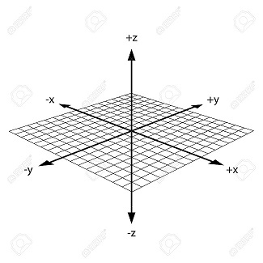

## Bottle Data Python Tool Box

### An Investigation of Temperature to Salinity off the Coast of California

**Update Sep 9, 2023** \
If you use this work in your research, please using the following citation:

```
@Misc{salinity_investigation,
author =   {Ed Rantanen},
title =    {Bottle Data Python Tool Box},
howpublished = {\url{https://github.com/erantanen/salinity_investigation}},
year = {2023-?}
}
```

The bottle data (csv) can be found at:\
https://calcofi.org/data/oceanographic-data/bottle-database/

The lat/long converter used is from:\
https://calcofi.com/index.php?option=com_content&view=article&id=272&Itemid=959

## The Coding?
The coding is very rough and ugly .. that being said it was put together in a very short amount of time
and it does what it is meant to do, and that is pre-process a huge static data set into 
smaller pieces that can be reviewed/tinkered with at a much faster rate. 

## The Idea
The bottle data is positional data in more than one sense, it has lat/long but also
depth so we have x/y and z as well as time series\
