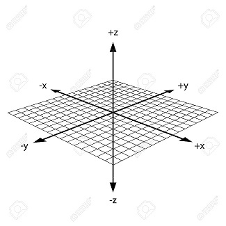

## Bottle Data Python Tool Box

### An Investigation of Temperature to Salinity off the Coast of California

**Update Sep 21, 2023** \
If you use this work in your research, please using the following citation:

```
@Misc{salinity_investigation,
author =   {Ed Rantanen},
title =    {Bottle Data Python Tool Box},
howpublished = {\url{https://github.com/erantanen/salinity_investigation}},
year = {2023-?}
}
```

The bottle data (csv) can be found at:\
https://calcofi.org/data/oceanographic-data/bottle-database/

The lat/long converter used is from:\
https://calcofi.com/index.php?option=com_content&view=article&id=272&Itemid=959

## The Data
The data is pulled from California Cooperative Ocean Fisheries Investigations, 
- 250Meg unzipped 
- 864K x74 (row/column) 
- 


Lat range: 17.40827 to 47.94102  (south to north )\
long range: -153.163 to -107.127 ((west to east))

General Reference: Golden Gate 37.809482,-122.501577


## The Coding?
The coding is very rough and ugly .. that being said it was put together in a very short amount of time, 
it does what it is meant to do, and that is process a huge amount of static data. As multiple graphs are
built code will be in a fluid state, along with the graphs, generating statics and the use of
LME(Linear Mixed Effects) libraries are also being worked or applied. Other libraries are brought in such
the Mann-Kendall, Augmented Dickey Fuller,and the Kwiatkowski-Phillips-Schmidt-Shin looking for both a trend
and a non-trend with time series data. 


## The Idea
The bottle data is positional data in more than one sense, it has lat/long but also
depth so we have x/y and z as well as time series\
